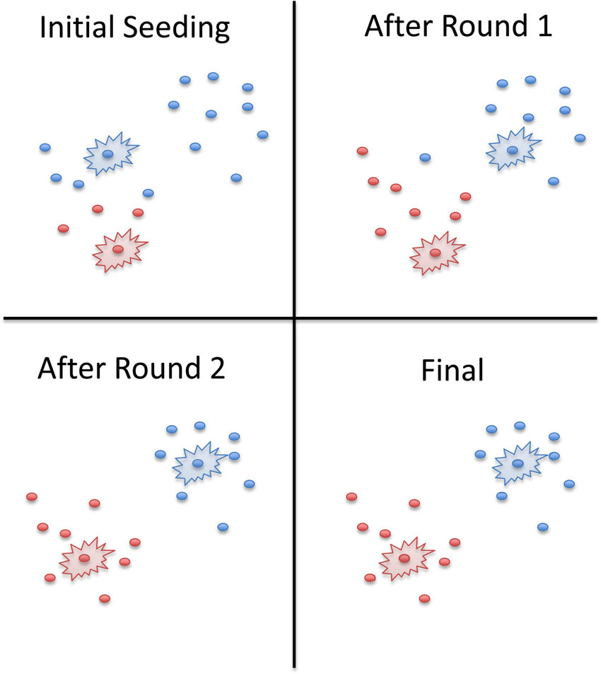
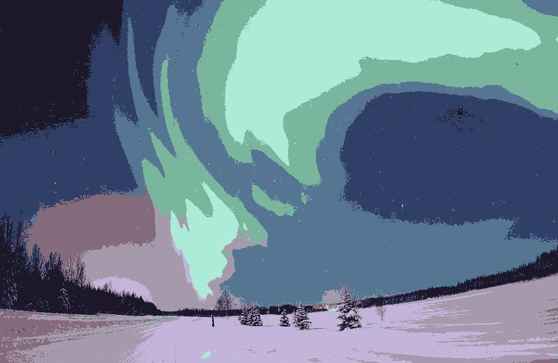
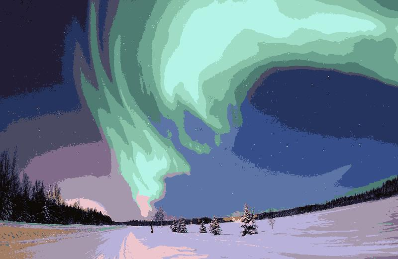
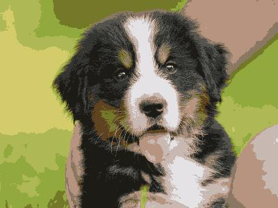

# Image Segmentation

## Project Description
This project is a web program that takes in an upload image file and the number of the clutters, then output the segmentation of the image uploaded by downsampling the pixels in an image, computing the clusters, and then reassigning the values to the larger image to get the sketch.

The project is developed for CSUN COMP467.

## Roadmap

**Epic** : Image Segmentation Web program

**Features** (High-level user stories)
- Algorithm Design: As a developer, I want to design a cluster algorithm with K-means method so that I can use it for further image segementation.

- Build segmentation program: As a typical user, I want to have a program that takes in an input of an image and the number of clusters so that the program will output a segmentation image with same number of clusters in color.

- Build web app: As a typical user, I want to have a web app that I can upload a image and select the number of clusters so that this web app will output a segmented image with same number of clusters in color.

## Requirements

This program build with python and streamlit. In order to run this program correctly, you will need to install the following dependencies: 

[python](https://www.python.org/downloads/), [numpy](https://numpy.org/install/), [pillow](https://pillow.readthedocs.io/en/stable/installation.html)

Or [Anaconda](https://www.anaconda.com/products/individual) which contains all above, and [Streamlit](https://docs.streamlit.io/library/get-started/installation)

## Deployment
Environment Check
```dotnetcli
pipenv shell
```
Run at localhost
```
streamlit run ImageSeg.py
```

Or deploy on the [Streamlit cloud](https://docs.streamlit.io/streamlit-cloud)

## Kmeans Algorithm
K-Means finds the best centroids by alternating between (1) assigning 
data points to clusters based on the current centroids (2) chosing centroids (points which are the center of a cluster) based on the current assignment of data points to clusters.



## Proof of Concept
You can find the PoC algorithm at this [notebook](Resource\ImageSeg_kmeans.ipynb)

---

## Live Demo
https://share.streamlit.io/shusunny/streamlit-project/ImageSeg.py

*You will need some time waiting the program to process the image especially if you upload a **large image and iterate many steps**.*

## Example Output
Original Image:


After segmentation with clusters K = 8 and 30 iterations.


After segmentation with clusters K = 16 and 50 iterations.


---
**Another Example**

Original Image:


After segmentation with clusters K = 8 and 30 iterations.




## Acknowledgment
The project is developed by Zhen Sun. All code can be found at:

https://gitlab.com/467_fall_2021/image-segmentation
https://github.com/shusunny/streamlit-project

## Support
Professor: Virginia Mushkatblat

