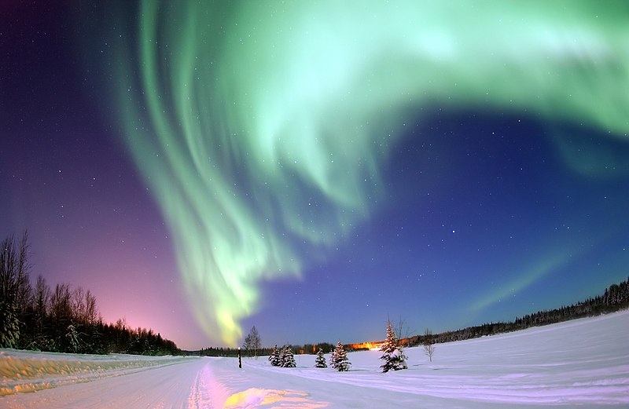

# Image Segmentation

## Name
Image Segmentation

## Description
This project is a web program that takes in an upload image file and the number of the clutters, then output the segmentation of the image uploaded by downsampling the pixels in an image, computing the clusters, and then reassigning the values to the larger image to get the sketch.

The project is developed for CSUN COMP467.

## Live Demo
https://share.streamlit.io/shusunny/streamlit-example

## Sample Result
Original Image:

---
After segmentation with clusters K = 16

## Authors and acknowledgment
The project is developed by Zhen Sun.

## Support
Professor: Virginia Mushkatblat

Edit `/streamlit_app.py` to customize this app to your heart's desire :heart:

If you have any questions, checkout our [documentation](https://docs.streamlit.io) and [community
forums](https://discuss.streamlit.io).

## Roadmap
High-level user stories.

- Algorithm Design: As a developer, I want to design a cluster algorithm with K-means method so that I can use it for further image segementation.

- Build segmentation program: As a typical user, I want to have a program that takes in an input of an image and the number of clusters so that the program will output a segmentation image with same number of clusters in color.

- Build web app: As a typical user, I want to have a web app that I can upload a image and select the number of clusters so that this web app will output a segmented image with same number of clusters in color.