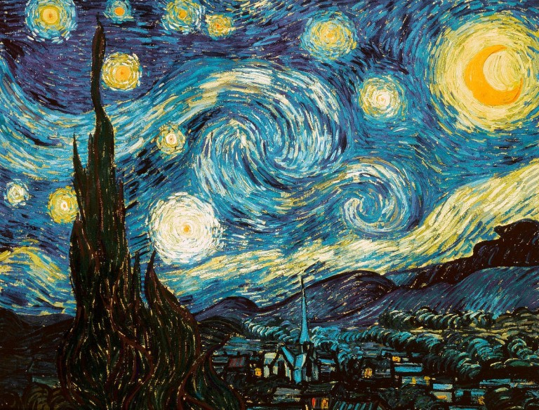
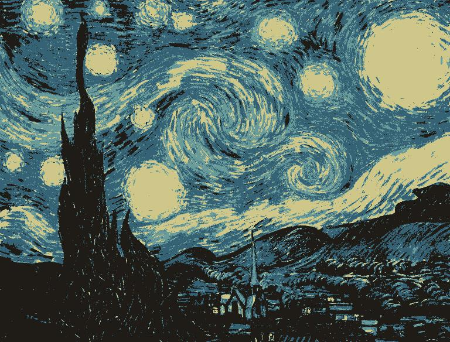
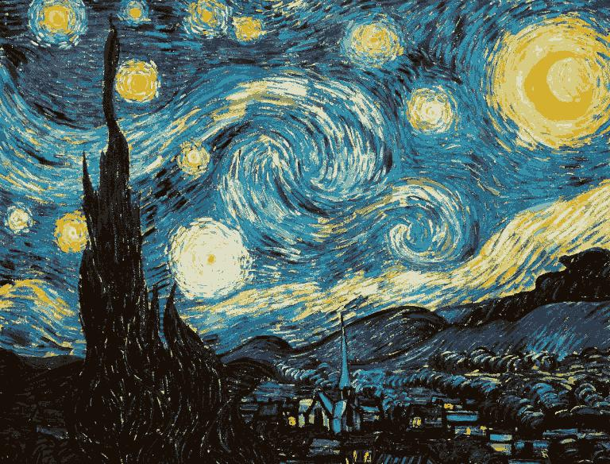
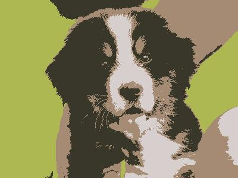

# Image Segmentation

## Project Description
This project uses kmeans algorithm to do the image segmentation, developed for CSUN COMP467.

## Roadmap

**Epic** : My application will be a web program that can upload an image file and assign the clutters number, and output the sketch of the image uploaded by downsampling the pixels in an image, computing the clusters, and then reassigning the values to the larger image.

**Features** (High-level user stories)
- Algorithm Design: As a developer, I want to implement K-means cluster algorithm so that I can use it for further image segmentation.

- Build python program: As a typical user, I want to have a program that takes in an input of an image and the number of clusters and iterations, so that the program will output a segmentation image with input parameters.

- Build web app: As a typical user, I want to have a web app that I can upload a image and select the number of clusters and iterations so that this web app will output a segmented image for me to download.

## Requirements

This program build with python and streamlit. In order to run this program correctly, you will need to install the following dependencies: 

[python](https://www.python.org/downloads/), [numpy](https://numpy.org/install/), [pillow](https://pillow.readthedocs.io/en/stable/installation.html) or

[Anaconda](https://www.anaconda.com/products/individual) which contains all above

and [Streamlit](https://docs.streamlit.io/library/get-started/installation)

## Deployment
Environment Check
```dotnetcli
pipenv shell
```
Run at localhost
```
streamlit run ImageSeg.py
```

Or deploy on the [Streamlit cloud](https://docs.streamlit.io/streamlit-cloud)

## Kmeans Algorithm
K-Means finds the best centroids by alternating between (1) assigning 
data points to clusters based on the current centroids (2) chosing centroids (points which are the center of a cluster) based on the current assignment of data points to clusters.


## Proof of Concept
You can find the PoC algorithm at this [notebook](https://github.com/shusunny/streamlit-project/blob/master/Resource/ImageSeg_kmeans.ipynb)

---

## Live Demo
https://share.streamlit.io/shusunny/streamlit-project/ImageSeg.py

*You will need some time waiting the program to process the image and **extra time** if you upload **a large image and iterate many steps**.*

## Example Output
Original Image, size = 236 kb.



After segmentation with clusters K = 4 and 16 iterations, it's doing some sketch of the image.



After segmentation with clusters K = 12 and 30 iterations, it keeps most of the information while size is 141 kb.



---
**Another Example**

Original Image:


Result with clusters K = 4 and 16 iterations, the algorithm converges pretty fast.




## Acknowledgment
The project is developed by Zhen Sun. All code can be found at:

https://gitlab.com/467_fall_2021/image-segmentation

https://github.com/shusunny/streamlit-project

## Support
Professor: Virginia Mushkatblat

